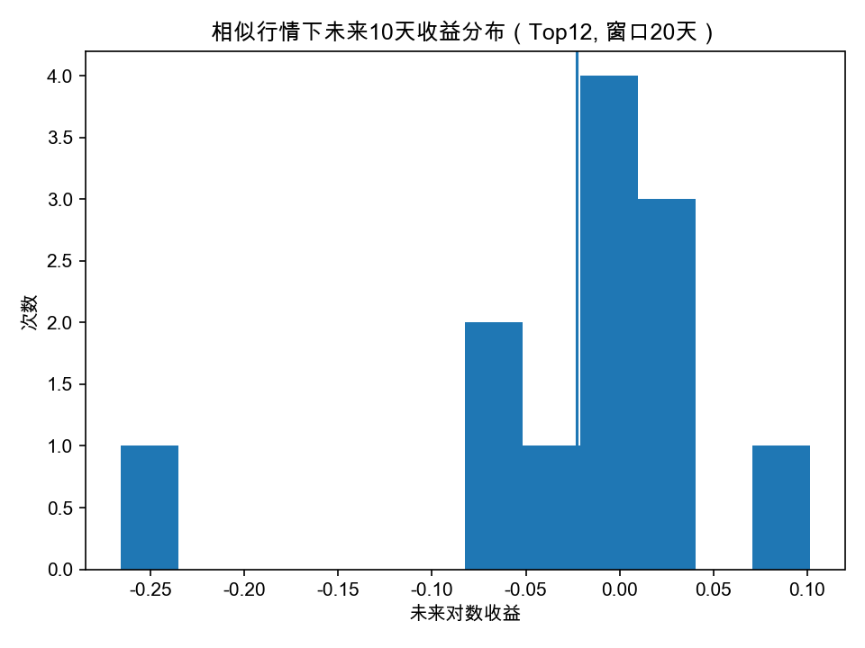

# BTC 量化分析入门版报告（结构 / 分布 / 风险）

> 生成时间：2026-02-02 01:09:58 UTC  ｜  数据截止：2026-02-02

## 阅读指南（给不懂量化的人）

- 这份报告**不预测价格**，只回答：在当前环境下，未来结果的**分布**大致如何。

- 重点关注：**p10 / min（左尾风险）**、胜率、以及当前是否接近“最容易亏钱状态”。

- 如果当前状态=最容易亏钱状态：优先考虑**降低风险暴露**，而不是加大操作频率。

## 0）市场基本画像（描述世界，不做判断）

| 开始日期 | 结束日期 | 样本天数 | 日对数收益均值 | 日对数收益中位数 | 日收益为正比例(胜率) | 30日年化波动均值(≈) |
| --- | --- | --- | --- | --- | --- | --- |
| 2010-08-30 | 2026-02-02 | 4100 | 0.00341184 | 0.00126832 | 0.521951 | 0.833597 |

## 1）市场状态（市场不是涨跌，而是状态切换）

- 当前状态编号：**3**（k=6）

### 各状态的平均特征（用于解释状态大概是什么环境）

| 状态 | 日收益均值 | 7日波动均值 | 30日波动均值 | 30日趋势均值 |
| --- | --- | --- | --- | --- |
| 0 | 0.0230095 | 0.0366342 | 0.040569 | 0.125489 |
| 1 | 0.07928 | 0.0694711 | 0.0645178 | 0.209447 |
| 2 | 0.0856113 | 0.120053 | 0.0996631 | 1.16686 |
| 3 | -0.00413899 | 0.0210138 | 0.0269691 | -0.00312238 |
| 4 | -0.0375934 | 0.0529527 | 0.0585553 | -0.0498793 |
| 5 | -0.0475868 | 0.116764 | 0.116842 | -0.0522497 |

## 2）风险识别（看左尾，而不是只看均值）

- 历史上最容易亏钱的状态编号：**4**（按均值+p10+胜率综合排序）

### 各状态未来收益分布摘要（未来窗口为 horizon 天）

| 状态 | 样本数 | 均值 | 胜率(>0) | p10(更看风险) | p25 | min(最差) | max(最好) |
| --- | --- | --- | --- | --- | --- | --- | --- |
| 4 | 687 | 0.00656091 | 0.522562 | -0.223587 | -0.0875412 | -0.763314 | 1.0927 |
| 3 | 1846 | 0.00943375 | 0.548754 | -0.126813 | -0.0463013 | -0.583892 | 0.528279 |
| 5 | 163 | 0.0463014 | 0.564417 | -0.230605 | -0.130654 | -0.583629 | 0.938509 |
| 0 | 993 | 0.0563033 | 0.617321 | -0.122794 | -0.0449446 | -0.592641 | 1.06794 |
| 1 | 304 | 0.121101 | 0.592105 | -0.173202 | -0.068433 | -0.434358 | 1.15758 |
| 2 | 97 | 0.196653 | 0.597938 | -0.392388 | -0.160761 | -0.83474 | 1.25958 |

## 3）相似行情 → 未来分布（分布，不是预测）

### 未来收益分布摘要（在“最相似的历史片段”条件下）

| 样本数 | 均值 | 标准差 | 最小值(min) | 10%分位(p10) | 中位数(p50) | 90%分位(p90) | 最大值(max) | 胜率(>0) |
| --- | --- | --- | --- | --- | --- | --- | --- | --- |
| 12 | -0.022801 | 0.0894334 | -0.266146 | -0.0684896 | 0.00153141 | 0.0314841 | 0.101712 | 0.583333 |

### 收益分布直方图

### 历史最相似的行情片段（Top 相似度）

| 相似窗口开始 | 相似窗口结束 | 相似度 | 未来10天对数收益 |
| --- | --- | --- | --- |
| 2025-02-08 | 2025-02-27 | 0.853419 | 0.0180211 |
| 2018-10-19 | 2018-11-15 | 0.841072 | -0.266146 |
| 2020-06-02 | 2020-06-29 | 0.840051 | 0.00461461 |
| 2015-05-08 | 2015-06-04 | 0.836755 | 0.101712 |
| 2024-05-31 | 2024-06-27 | 0.834861 | -0.0671448 |
| 2023-07-24 | 2023-08-18 | 0.830377 | -0.016734 |
| 2014-07-21 | 2014-08-15 | 0.830321 | 0.0322422 |
| 2024-05-29 | 2024-06-25 | 0.818587 | -0.0686391 |
| 2025-08-07 | 2025-08-26 | 0.815522 | 0.000680729 |
| 2025-07-16 | 2025-08-04 | 0.812154 | 0.0246619 |
| 2023-07-26 | 2023-08-22 | 0.808051 | 0.00238208 |
| 2015-07-24 | 2015-08-20 | 0.807955 | -0.0392632 |

## 4）结论提醒（不做预测，只做风险约束）

- 当前状态与“最容易亏钱状态”不同：不代表一定有利，但历史上风险结构相对没那么差。

- 任何单次结果都可能偏离统计分布；报告价值在于帮助你避免“在不利环境下高频决策”。

---
## 📘 附录：报告术语白话解释（给不懂量化的读者）
### 量化分析
用数据和统计方法约束判断，不靠感觉；这份报告不做“方向预测”。

### 分布
不是一个结果，而是一组可能结果的范围。左边通常代表亏损，右边代表盈利。

### 市场状态 / 状态编号（k=6）
把市场按行为特征分成 6 类环境；编号只是标签，是否危险要看风险统计。

### 波动（7日/30日）
价格上下晃动的剧烈程度。波动越大，短期越不稳定。

### 趋势（30日趋势）
最近 30 天整体偏向上涨还是下跌。

### 未来窗口（horizon，如未来10天）
用来统计“类似情况下后面通常发生什么”，不是预测。

### p10（10%分位数）/ min（最差）
p10 表示最差的 10% 情况通常会亏多少；min 是历史最极端一次亏损，用来理解左尾风险。

### 最容易亏钱的状态
综合均值、p10、胜率后历史上更不友好的环境，不代表必亏，只表示更容易出现不利分布。

### 如何用这份报告
它不是告诉你怎么赢，而是帮助你避免在历史上不友好的环境里做激进决策。
